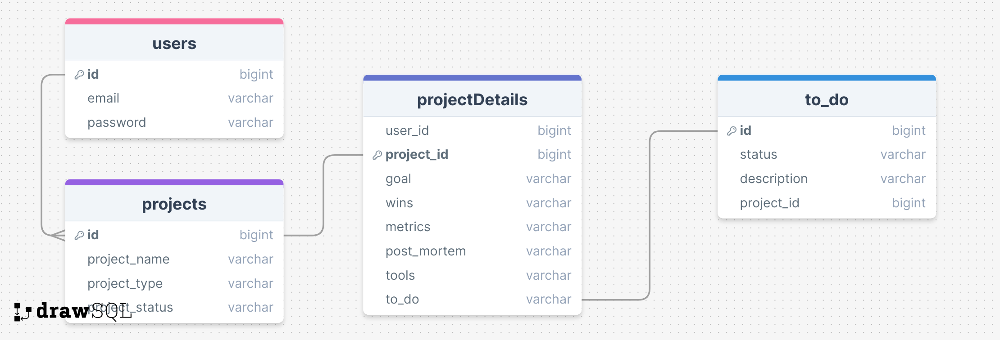

# Project Title

projectLab 

## Overview

*What is your app? Brief description in a couple of sentences.*

projectLab is a web-based project management application that anyone can use for personal project portfolio management. Although with my research background, it was built with graduate students and research professionals in mind, it is versatile enough to be used by anyone wanting to build further structure around their research, personal or professional projects (theses/goals). It is also, more broadly, a project management tool that can be used to summarize any sub-projects they do at work to build a living portfolio and make interview preparation easier. 

### Problem

*Why is your app needed? Background information around any pain points or other reasons.*

As a research professional myself, I understand that research projects are inherently more unstructured by nature, to allow for exploratory methods and practices. However, some structure is necessary to narrow your problem space and contribute meaningfully to an open research problem. As an early-career researcher, sometimes it can be challenging to differentiate the high-level research goals from immediate day-to-day tasks and there isn't often a reinforced post-mortem for failed experiments. As a late-stage researcher, the notes from early career/project documents are often disorganized when trying to synthesize background research/notes/results/methods into a thesis/research paper/scientific journal publication.

Furthermore, it is important to be able to effectively communicate your work when going into an interview, where being able to share key findings/metrics/statistics associated with your body of work is paramount. This is both a project portfolio in addition to a project management tool to enforce more structure in this space. 

Current available project management tools/apps, like Asana, ClickUp & Jira, (all of which I have previously used in research settings, or a combination of), have their weaknesses when it comes to lofty research goals/projects or any repetitive processes that are involved with experimental projects. 

This project is motivated by my work at an early-stage research startup. My role as a researcher in industry helped me understand the needs of my team. This work is also inspired by my experiences as a graduate research student who wrote a thesis and was interviewing while transitioning into industry. Having worked around a lot of researchers I see a gap in this space that could be filled in terms of how they manage their brand and their projects. 

### User Profile

*Who will use your app? How will they use it? Any special considerations that your app must take into account.*

- **Research Professionals/Research Students/Researchers**:
    - looking to improve their research methodology
    - looking to add additional structure to their research projects 
    - looking to add structured post-mortem reflection to failed/completed projects 
    - that want to keep track of the projects they have built
    
- **Personal Portfolio**
    - anyone interested in using this as a private personal portfolio 
    - can be used to prepare for interviews

### Features

*List the functionality that your app will include. These can be written as user stories or descriptions with related details. Do not describe __how__ these features are implemented, only __what__ needs to be implemented.*

- As a user, I want to be able to create an account to manage my projects **(Nice-to-have)**
- As a user, I want to be able to login to my account to manage my projects **(Nice-to-have)**

- As a logged-in user, I want to be able to organize my research by project
- As a logged-in user, I want to be able to organize my project by methods, results, post-mortem, broad/narrow goals
- As a logged-in user, I want to be able to visualize relevant metrics associated with my project **(Nice-to-have)**
- As a logged-in user, I want to be able to view my outstanding tasks 

## Implementation

### Tech Stack

*List technologies that will be used in your app, including any libraries to save time or provide more functionality. Be sure to research any potential limitations.*

- React
- MySQL (maybe MongoDB: **Nice-to-have**) 
- Express
- Client libraries: 
    - react
    - react-router
    - axios
- Server libraries:
    - knex
    - express
    - bcrypt for password hashing **(Nice-to-have)**

### APIs

*List any external sources of data that will be used in your app.*

- No external APIs will be used for the first sprint

### Sitemap

*List the pages of your app with brief descriptions. You can show this visually, or write it out.*

- Register **(Nice-to-have)**
- Login **(Nice-to-have)**
- Home page/Landing Page 
- List projects dashboard 
- View + Edit project dashboard
- Add Project Page 

### Mockups

*Provide visuals of your app's screens. You can use tools like Figma or pictures of hand-drawn sketches.*

##### Register
##### Login
##### Home page
##### List projects dashboard 
##### View + Edit project dashboard


### Data

*Describe your data and the relationships between them. You can show this visually using diagrams, or write it out.*

##### drawSQL diagram 


### Endpoints

*List endpoints that your server will implement, including HTTP methods, parameters, and example responses.*

**GET /projects** 

- Get all projects for a particular user 

Parameters:
- **token** (**nice-to-have**): JWT 

Response:
```
[
    {
        "id": 1,
        "project_name": "Ion-Trap Motional Mode Simulation",
        "project_type": academic,
        "project_status: ongoing,
    },
    ...
]
```

**GET /projects/:id**

- Get project by id

Parameters:
- **id**: Project id as a number
- **token** (**nice-to-have**):  JWT 

Response:
```
{
    "user_id": "1",
    "project_id": 1,
    "goal": ["Update a simulation to account for multiple isotopes in motional mode structure"],
    "wins": ["Launched an open-source project"], 
    "metrics": ["Publication citation rate is up 45\%"]
    "post_mortem": ["Project is still ongoing"], 
    "tools": ["Python", "SciPy", "QuTip"],
    "to_do": [
            {
            description: "Lorem ipsum",
            id: "todo_id",
            status: "initial"
            },
            {
            description: "Lorem ipsum",
            id: "todo_id",
            status: "finished"
            }
    ]
}
```

**POST /projects/**

- Logged in user can create a new project 

Parameters:
- **id**: project id 
- **token**: JWT of the logged in user (**nice-to-have**)
- **project_name**
- **project_type**: dropdown menu 
- **project_status**: dropdown menu 

Response:
```
[
    {
        "id": 1,
        "project_name": "Ion-Trap Motional Mode Simulation",
        "project_type": academic,
        "project_status: ongoing,
    },
    ...
]
```

**PUT /projects/:id/**

- Logged in user can update/edit their project 

Parameters:
- **id**: project id
- **token**: JWT of the logged in user
- **information to add** (ie. to-do item) 

Response:
```
{
    "id": 1,
    "user_id": "1",
    "project_id": 3,
    "goal": ["Update a simulation to account for multiple isotopes in motional mode structure"],
    "wins": ["Launched an open-source project"], 
    "metrics": ["Publication citation rate is up 45\%"]
    "post_mortem": ["Project is still ongoing"], 
    "tools": ["Python", "SciPy", "QuTip"],
    "to_do": <todo id>
}
```

#### Nice-to-Haves 

**POST /users/register**

- Add a user account

Parameters:
- **email**: User's email
- **password**: User's provided password

Response:
```
{
    "token": "seyJhbGciOiJIUzI1NiIsInR5cCI6IkpXVCJ9.eyJzdWIiOiIxMjM0NTY3ODkwIiwibmFtZSI6I..."
}
```

**POST /users/login**

- Login a user

Parameters:
- **email**: User's email
- **password**: User's provided password

Response:
```
{
    "token": "seyJhbGciOiJIUzI1NiIsInR5cCI6IkpXVCJ9.eyJzdWIiOiIxMjM0NTY3ODkwIiwibmFtZSI6I..."
}
```

### Auth

*Does your project include any login or user profile functionality? If so, describe how authentication/authorization will be implemented.*

#### Nice-To-Have

- JWT auth
    - Before adding auth, all API requests will be using a fake user with id 1
    - Added after core features have first been implemented
    - Store JWT in localStorage, remove when a user logs out
    - Add states for logged in showing different UI in places listed in mockups

## Roadmap

*Scope your project as a **sprint**. Break down the tasks that will need to be completed and map out timeframes for implementation. Think about what you can reasonably complete before the due date. The more detail you provide, the easier it will be to build.* 

- Create **client**
    - react project with routes and boilerplate pages

- Create **server**
    - express project with routing, with placeholder 200 responses

- Create **migrations** for the db 

- Create **sample** project 

- Create **seeds** with sample project data 

- **Feature**: List projects 
    - Implement projects list page including the completion amount
    - Create GET /projects endpoint

- **Feature**:  View project 
    - Implement view project dashboard page 
    - Create GET /projects/:id endpoint 

#### Nice-to-Haves

- **Feature**:  Add project 
    - Implement add project page
    - Create POST /projects/ endpoint 
    
- **Feature**:  Edit project 
    - Implement edit project feature(s) 
    - Create PUT /projects/:id endpoint 

- Feature: Create account
    - Implement register page + form
    - Create POST /users/register endpoint

- Feature: Login
    - Implement login page + form
    - Create POST /users/login endpoint

- Feature: Implement JWT tokens
    - Server: Update expected requests / responses on protected endpoints
    - Client: Store JWT in local storage, include JWT on axios calls

- Bug fixes

- Presentation/DEMO for DEMO DAY

- DEMO DAY

## Nice-to-haves

*Your project will be marked based on what you committed to in the above document. Under nice-to-haves, you can list any additional features you may complete if you have extra time, or after finishing.*

- **Deploy** client and server projects so all commits will be reflected in production

- Integrate Gemeni backend API request to summarize research articles on the fly and keep those summaries on the dashboard 

- Forgot password functionality 

- Ability to add a project 
    - POST request to the projects endpoint 

- Ability to edit a project 
    - PUT request to the projects/:id endpoint 

- Expand dashboard to include further metrics about each project 

- Expanded user information/profile: 
    -  full name
    -  research title
    -  school/associated institution 
    
- Add project tags
	- Each project will have a tag associated with it to group similar projects 
	
- Add project status tags
	- Each project will hav a tag associated with it's status 
    
- Project Search Functionality on Projects List/Overview Dashboard page: 
	- be able to search for a project based on name
	- search group of projects based on tags (see tags feature)
	
- Add an overview statistics header to the project overview page that displays stats about your project 

- On Add Project Page 
	- have an associated icon with each of the project types/categories (ie. Theory/Experiment/Personal/Student/Research Pro)
	
- Integrate animations/pop-outs when editing each of the project dashboard areas (Modals) 

- Unit and Integration Tests

## References 

- https://www.freecodecamp.org/news/build-a-todo-app-from-scratch-with-reactjs/
- https://medium.com/@worachote/building-a-todo-list-app-with-reactjs-a-step-by-step-guide-2c58b9b6c0f5
- https://ai.google.dev/gemini-api/docs/get-started/tutorial?lang=node